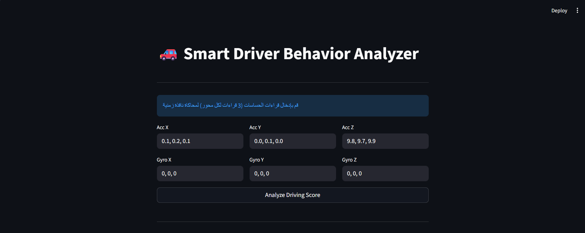
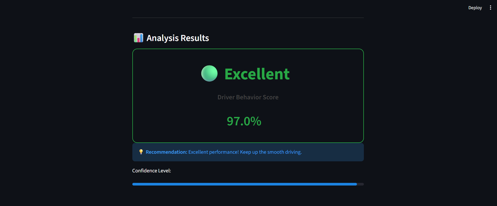

# 🚗 Driver Behavior Analysis System (V2)

## 1️⃣ نظرة عامة على المشروع (Project Overview)

يهدف هذا المشروع إلى **تحليل سلوك السائقين** باستخدام بيانات حقيقية مأخوذة من حساسات الهواتف الذكية، وذلك لتصنيف أسلوب القيادة إلى:

* **Safe Driving (0)** – قيادة آمنة
* **Aggressive Driving (1)** – قيادة عدوانية / متهورة

يعتمد النظام على دمج بيانات **Accelerometer** و **Gyroscope** ومعالجتها عبر Pipeline كامل، ثم تمريرها إلى نموذج **Machine Learning** من نوع Random Forest لاتخاذ القرار النهائي.

المشروع مصمم ليكون:

* عملي (Real-world)
* قابل للتشغيل الفوري عبر API
* مناسب للاستخدام داخل تطبيق موبايل أو Dashboard

---

## 2️⃣ البيانات الخام (Raw Data)

البيانات الخام هي **حجر الأساس** لهذا المشروع، وفهمها بعمق هو العامل الأهم للنجاح في التنفيذ والمناقشة.
الداتا المستخدمة **حقيقية ومعقدة**، وتم جمعها مباشرة من حساسات الهاتف أثناء رحلات قيادة فعلية.

---

## 📂 2.1 هيكل ملفات البيانات الخام

الداتا مقسمة إلى عدة ملفات CSV و JSON، كل ملف يمثل حساسًا معينًا أو معلومات توثيقية.

### 🔹 أولاً: ملفات الحساسات (Core Sensor Files)

#### 📄 acelerometro_terra.csv

* يسجل **التسارع** على المحاور الثلاثة: X, Y, Z
* نوع البيانات: *Terra*

  * أي أنها مصححة بالنسبة لجاذبية الأرض
  * النظام يميز بين اتجاه الأرض واتجاه الهاتف حتى لو كان الهاتف مائلاً

**الأعمدة:**

* `timestamp` : التوقيت الزمني
* `uptimeNanos` : وقت المعالج بالنانو ثانية
* `x , y , z` : قيم التسارع لكل محور

📌 الاستخدام:

* كشف الفرامل المفاجئة
* التسارع الحاد
* الانحرافات الجانبية

---

#### 📄 giroscopio_terra.csv

* يسجل **سرعة الدوران (Angular Velocity)** حول المحاور الثلاثة

📌 الأهمية:

* كشف الملفات الحادة (Sharp Turns)
* كشف الغرز وتغيير الحارة (Lane Changes)

---

#### 📄 aceleracaoLinear_terra.csv

* مشابه للأكسيليروميتر
* **لكن بدون تأثير الجاذبية الأرضية تمامًا**

📌 الفائدة:

* تسجيل الحركة الناتجة فقط عن:

  * الموتور
  * الفرامل
  * تسارع السيارة الحقيقي

---

#### 📄 campoMagnetico_terra.csv

* يمثل حساس **Magnetometer (البوصلة)**

📌 الاستخدام:

* تحديد الاتجاه الجغرافي للسيارة
* دعم فهم اتجاه الحركة

---

### 🔹 ثانياً: ملفات التوثيق والـ Labels (Metadata & Labels)

#### 📄 groundTruth.csv (أهم ملف في المشروع)

* يمثل **المرجع الحقيقي (Ground Truth)**
* يحتوي على تصنيف يدوي للأحداث أثناء القيادة

📌 مثال:

* من الثانية 20 إلى 25 → Curva Agressiva

بدون هذا الملف:

> ❌ لا يمكن تدريب الموديل، لأنه لن يعرف الفرق بين القيادة الآمنة والعدوانية

---

#### 📄 viagem.json

يحتوي على معلومات عامة عن الرحلة مثل:

* نوع الهاتف (مثلاً: XT1058)
* إصدار أندرويد
* وقت بداية ونهاية الرحلة

---

## 🔍 2.2 تفاصيل فنية داخل الداتا (Why This Data Matters)

### ⏱️ أ- التوقيت الزمني (Sampling Rate)

* الداتا مسجلة بتردد يقارب **50Hz**
* أي: 50 قراءة في الثانية الواحدة

📌 الفائدة:

* التقاط التغيرات السريعة جدًا
* كشف الفرامل المفاجئة أو الحركات العنيفة خلال أجزاء من الثانية

---

### 📐 ب- المحاور الثلاثة (X, Y, Z)

كل محور يمثل نوعًا مختلفًا من الحركة:

* **محور Y (Longitudinal):**

  * التسارع للأمام
  * الفرملة

* **محور X (Lateral):**

  * الانحراف يمينًا ويسارًا
  * تغيير الحارات

* **محور Z (Vertical):**

  * المطبات
  * الاهتزازات الرأسية

---

## 🔄 2.3 كيف تحولت الداتا إلى Classification؟

التحويل تم عبر ملفي `preprocess.py` و `features.py` وفق الخطوات التالية:

### 🔹 1. المزامنة الزمنية (Synchronization)

* كل حساس يسجل بتوقيت مختلف قليلًا
* تم دمج البيانات بناءً على أقرب Timestamp
* النتيجة: صف واحد يمثل حالة السيارة في لحظة زمنية واحدة

---

### 🔹 2. حساب الـ Magnitude

بدل الاعتماد على اتجاه الهاتف داخل السيارة، تم حساب القوة الكلية:

$$Mag = \sqrt{x^2 + y^2 + z^2}$$

📌 الفائدة:

* تجاهل وضعية الهاتف
* قياس **عنف الحركة** بغض النظر عن الاتجاه
* تحسين تعميم الموديل

---

### 🔹 3. ربط الأحداث بالـ Labels

* تمت مقارنة كل لحظة زمنية مع `groundTruth.csv`
* إذا كانت داخل فترة قيادة عدوانية → **Label = 1**
* غير ذلك → **Label = 0**

وبذلك تحولت البيانات الخام إلى **بيانات صالحة للتدريب والتصنيف**.

---

## 3️⃣ ملف preprocess.py – قلب الـ Data Engineering في المشروع

ملف `preprocess.py` هو **المهندس الأساسي** المسؤول عن تحويل البيانات الخام المبعثرة في ملفات منفصلة إلى جدول واحد منظم وجاهز للاستخدام داخل نموذج الذكاء الاصطناعي.

من غير هذا السكريبت:

* لا يمكن ربط قراءات الحساسات المختلفة بالزمن
* لا يمكن مطابقة الحركات مع تصنيفات القيادة (Safe / Aggressive)
* لا يمكن تدريب موديل يعتمد عليه

---

## 🔹 3.1 قراءة وتنظيف البيانات (Reading & Cleaning)

في البداية، يقوم السكريبت بالبحث داخل فولدر كل رحلة عن الملفات الأساسية التالية:

* `acelerometro_terra.csv` → بيانات التسارع
* `giroscopio_terra.csv` → بيانات الدوران
* `groundTruth.csv` → التصنيف البشري للأحداث

### ✨ لمسة احترافية مهمة

تم استخدام الخيار التالي أثناء قراءة ملفات CSV:

* `skipinitialspace=True`

📌 السبب:

* ملفات CSV الخام غالبًا تحتوي على مسافات غير مرئية قبل أسماء الأعمدة (مثل " x" بدل "x")
* هذه المشكلة تؤدي إلى أخطاء شائعة مثل `KeyError`
* هذا الخيار ينظف الأعمدة تلقائيًا ويجعل الكود أكثر صلابة

---

## 🔹 3.2 توحيد الزمن (Time Normalization)

الحساسات تسجل الوقت بصيغة `uptimeNanos` (نانو ثانية)، وهي قيم ضخمة وغير عملية للتحليل المباشر.

### ما الذي تم عمله؟

* طرح وقت بداية الرحلة من كل قراءة
* قسمة الناتج على (10^9)

### النتيجة:

* تحويل الزمن إلى ثواني بسيطة تبدأ من:

  * 0.0
  * 0.1
  * 0.2

📌 الفائدة:

* سهولة قراءة وتحليل الزمن
* التوافق الكامل مع ملف `groundTruth.csv` الذي يعمل بوحدة الثواني

---

## 🔹 3.3 دمج الحساسات الذكي (Smart Sensor Fusion)

### المشكلة:

* الـ Accelerometer والـ Gyroscope لا يسجلان في نفس اللحظة بالضبط
* الفرق قد يكون أجزاء من الثانية

### لماذا الدمج العادي لا يصلح؟

* `Normal Join` يعتمد على تطابق الزمن 100%
* يؤدي إلى فقدان كمية كبيرة من البيانات

### الحل المستخدم: `pd.merge_asof`

* يقوم بدمج البيانات بناءً على **أقرب توقيت زمني**
* يربط قراءة الجايرو بأقرب قراءة أكسيلرومتر زمنياً

### النتيجة:

صف واحد يمثل لحظة زمنية واحدة يحتوي على:

* `x_acc , y_acc , z_acc`
* `x_gyro , y_gyro , z_gyro`

📌 هذه الخطوة هي الأساس الحقيقي لنجاح الموديل

---

## 🔹 3.4 وضع العلامات (Labeling / Target Creation)

بعد دمج الحساسات، يكون لدينا جدول حركات فقط بدون معرفة نوع القيادة.

### آلية العمل:

* قراءة ملف `groundTruth.csv` سطرًا سطرًا
* البحث عن الأحداث التي تحتوي على كلمة `agressiva`
* إنشاء Mask زمني يغطي نفس الفترة داخل جدول الحساسات

### النتيجة:

* أي لحظة داخل فترة Aggressive → `target = 1`
* باقي اللحظات → `target = 0`

📌 عمود `target` هو ما يتعلم منه الموديل الفرق بين:

* القيادة الطبيعية
* القيادة العنيفة

---

## 🔹 3.5 تجميع الرحلات (Data Aggregation)

الدالة `prepare_all_data` مسؤولة عن:

* المرور على جميع فولدرات الرحلات (Trip_01, Trip_02, ...)
* تنفيذ جميع الخطوات السابقة لكل رحلة على حدة
* دمج كل الرحلات باستخدام `concat`

### المخرج النهائي:

* ملف واحد ضخم ومنظم: `merged_data.csv`
* يحتوي على كل القراءات وكل الـ labels وجاهز للـ Feature Engineering

---

## 💡 لماذا هذا الملف مهم جدًا في مشروع التخرج؟

إذا تم سؤالك:

> "كيف قمت بربط بيانات الحساسات المسجلة في أوقات مختلفة؟"

إجابتك الاحترافية:

> "استخدمت Time Normalization لتحويل الزمن إلى ثواني موحدة، ثم استخدمت merge_asof لربط قراءات الحساسات المختلفة بناءً على أقرب توقيت زمني، مما ضمن دقة عالية في البيانات قبل تدريب نموذج التعلم الآلي."

---
## 4️⃣ ملف features.py – Feature Engineering وتحويل الزمن إلى سلوك

ملف `features.py` هو **مطبخ البيانات الحقيقي** في المشروع.  
فيه بنحوّل لغة الحساسات الخام (Time-Series) إلى لغة يفهمها الذكاء الاصطناعي (Features رقمية).

الموديل لا يفهم:
> x = 0.52 عند الثانية 12.4  

لكنه يفهم:
> متوسط التسارع عالي + التذبذب عالي → سلوك قيادة غير مستقر  

وده بالضبط اللي بيعمله الملف ده.

---

## 🔹 4.1 فكرة الملف بشكل عام
الملف يستقبل:
- `merged_data.csv` (ناتج preprocess.py)

ويخرج:
- Dataset جديد
- كل صف فيه يمثل **فترة زمنية كاملة من السواقة**
- بدل ما يكون قراءة لحظية

📌 الهدف:  
تحويل **السلوك عبر الزمن** إلى أرقام إحصائية مستقرة قابلة للتعلم.

---

## 🔹 4.2 حساب محصلة الحركة (Magnitude Calculation)

### المشكلة
قيم X, Y, Z تعتمد بشكل كبير على:
- وضعية الهاتف
- ميله داخل السيارة

وده يخلي الاعتماد عليها مباشرة غير دقيق.

### الحل
تم حساب محصلة الحركة باستخدام:

$$
Mag = \sqrt{x^2 + y^2 + z^2}
$$

### ما الذي تم حسابه؟
- `acc_mag` → محصلة التسارع  
- `gyro_mag` → محصلة الدوران  

📌 الفائدة:
- تجاهل اتجاه الهاتف
- التركيز على **شدة الحركة نفسها**
- تحسين تعميم الموديل على سيناريوهات مختلفة

---

## 🔹 4.3 تقنية النافذة المنزلقة (Sliding Window Strategy)

### لماذا لا نستخدم كل لحظة لوحدها؟
- اللحظة الواحدة قد تكون Noise
- أو مطب
- أو حركة عشوائية

لكن **نمط القيادة الحقيقي يظهر عبر فترة زمنية**.

### الإعدادات المستخدمة:
- `window_size = 100`  
  - تمثل تقريبًا **ثانيتين من القيادة** (عند 50Hz)

- `step_size = 50`  
  - تداخل بنسبة 50%
  - يمنع فقدان أي حركة مهمة

📌 النتيجة:
- كل نافذة = مقطع سلوكي
- الموديل يتعلم من السلوك مش من لحظة عابرة

---

## 🔹 4.4 استخراج الميزات الإحصائية (Feature Extraction)

داخل كل نافذة (100 قراءة)، يتم تلخيص البيانات في مجموعة صغيرة من الميزات الذكية:

### ✳️ ميزات التسارع (Acceleration Magnitude):
- **Mean**  
  → القوة المستمرة للحركة  

- **Std (الانحراف المعياري)**  
  → أهم ميزة، تقيس التذبذب وعدم الاستقرار  

- **Max**  
  → التسارع أو الفرملة المفاجئة  

- **Min**  
  → مستوى الثبات  

- **Variance**  
  → تأكيد عدم الاستقرار  

### ✳️ ميزات الدوران (Gyroscope Magnitude):
- **Mean**  
  → متوسط شدة الملفات  

- **Std**  
  → كثرة وتغير اتجاه الملفات  

- **Max**  
  → الملفات الحادة المفاجئة  

📌 بهذه الطريقة:
- 100 قراءة × 6 محاور  
⬇️  
- 8 أرقام فقط تلخص السلوك بدقة

---

## 🔹 4.5 تحديد الـ Target لكل نافذة

### المنطق المستخدم:
> لو حدثت قيادة عنيفة **مرة واحدة فقط** داخل النافذة  
→ يتم اعتبار النافذة كلها عنيفة

### التنفيذ:
- استخدام `window['target'].max()`
- إذا كانت = 1 → `target = 1`
- غير ذلك → `target = 0`

📌 منطق واقعي:
- السائق العنيف لا يكون عنيفًا طوال الوقت
- لكن لحظة خطيرة واحدة كافية لتصنيف الفترة كلها

---

## 🔹 4.6 بناء Dataset النهائي

بعد المرور على كل الرحلة:
- يتم تجميع كل النوافذ في DataFrame جديد
- حفظه في ملف CSV جديد (Features Dataset)

### التحول النهائي:
- **الدخل:** مئات الآلاف من قراءات الحساسات  
- **الخرج:** Dataset صغير، نظيف، وجاهز للتدريب  

كل صف يمثل:
> فترة زمنية من القيادة + توصيف إحصائي + تصنيف واضح

---

## 💡 سؤال متوقع جدًا في المناقشة

**لماذا لم يتم استخدام بيانات X, Y, Z الخام مباشرة في التدريب؟**

### الإجابة النموذجية:
> "لأن بيانات الحساسات الخام تعتمد على وضعية الهاتف وتحتوي على Noise عالي. باستخدام Magnitude مع Statistical Features عبر Sliding Window، تم تلخيص نمط القيادة الحقيقي في قيم إحصائية مستقرة، مما حسّن أداء الموديل ورفع الدقة بشكل ملحوظ."

---
## 5️⃣ ملف train.py – تدريب العقل الصناعي وتقييمه

ملف `train.py` يمثل **قلب المشروع**، وهو المرحلة التي يتم فيها تحويل البيانات المُهندسة (Features) إلى **نموذج ذكي قادر على اتخاذ القرار**.

في هذا الملف لا نقوم فقط بتشغيل كود، بل نطبق مفاهيم Machine Learning احترافية لضمان:
- تعميم النموذج (Generalization)
- تقليل الحفظ الأعمى (Overfitting)
- تقييم عادل وواقعي للأداء

---

## 🔹 5.1 تقسيم البيانات (Train / Test Split)

أول خطوة هي تقسيم البيانات إلى:
- **80% Training Set**
- **20% Test Set**

### الهدف:
- تدريب النموذج على جزء من البيانات
- اختباره على بيانات **لم يسبق له رؤيتها**

وده يضمن إن الموديل:
- مش حافظ الداتا
- لكنه فاهم النمط الحقيقي للسواقة

### ✨ تكتيك احترافي: `stratify=y`
بما إن حالات القيادة العدوانية أقل من القيادة الآمنة، تم استخدام:
```python

train_test_split(X, y, test_size=0.2, stratify=y)

```

---

## Pipeline Architecture – `pipeline.py`

ملف `pipeline.py` هو حلقة الوصل الحرجة بين **العالم الحقيقي (السواق والموبايل)**
وبين **عقل الموديل (Machine Learning Model)**.

يمكن اعتبار الـ Pipeline بمثابة *المترجم الذكي*:

* يستقبل بيانات خام غير منظمة
* ينقّيها ويحوّلها
* ثم يقدّمها للموديل بالشكل الوحيد اللي يقدر يفهمه

بدون الـ Pipeline، الموديل هيستقبل بيانات عشوائية وغير متناسقة، وده يؤدي لنتائج غير منطقية.

---

## 1. تحميل الموديل (Model Initialization)

```python
class DriverPipeline:
    def __init__(self, model_path):
        self.model = joblib.load(model_path)
```

### ماذا يحدث هنا؟

* يتم تحميل الموديل المدرب مسبقًا من ملف `.pkl`
* الموديل **مش بيتدرب هنا**، بل جاهز للاستخدام (Inference)

### لماذا هذا مهم؟

* التدريب عملية مكلفة جدًا حسابيًا
* في تطبيق Real-Time (موبايل / API) لا يمكن إعادة التدريب لكل مستخدم
* الحل الاحترافي: **Train Once – Use Everywhere**

---

## 2. استقبال وتحضير البيانات (Input Handling)

```python
df_acc = pd.DataFrame(acc_data)
df_gyro = pd.DataFrame(gyro_data)
```

### شكل البيانات الداخلة:

* `acc_data`: قائمة تحتوي على ~100 قراءة Accelerometer
* `gyro_data`: قائمة تحتوي على ~100 قراءة Gyroscope
* كل قراءة تحتوي على (`x`, `y`, `z`)

### التحديات الواقعية:

* البيانات قد تكون ناقصة
* ترتيب المحاور قد يختلف
* الموبايل قد يكون في أي وضعية داخل العربية

### دور الـ Pipeline:

* تحويل القوائم إلى DataFrame
* توحيد الشكل البنيوي للبيانات
* تجهيزها للمعالجة الرياضية

---

## 3. إزالة تأثير وضعية الموبايل (Vector Magnitude)

```python
acc_mag = sqrt(x² + y² + z²)
gyro_mag = sqrt(x² + y² + z²)
```

### المشكلة:

لو الموديل اتدرب والموبايل:

* مرة أفقي
* مرة رأسي
* مرة مقلوب

فإن:

* محور X قد يصبح Y
* محور Y قد يصبح Z

وده يدمّر أي نموذج ML.

### الحل الرياضي:

استخدام **Magnitude (المحصلة)**:

```
Mag = sqrt(X^2 + Y^2 + Z^2)
```

### النتيجة:

* عمود `acc_mag`
* عمود `gyro_mag`
* قيمهم ثابتة مهما اتغير اتجاه الموبايل
* بتمثل قوة الحركة بدل اتجاهها

---

## 4. ضغط البيانات (Feature Aggregation)

### لماذا؟

* الموديل لا يستطيع اتخاذ قرار بناءً على 100 صف.
* هو متدرب على صف واحد فقط يمثل نافذة زمنية كاملة.

### الحل:

تحويل الإشارة الزمنية إلى **Statistical Features**

```python
features = {
    'acc_mag_mean',
    'acc_mag_std',
    'acc_mag_max',
    'acc_mag_min',
    'acc_mag_var',
    'gyro_mag_mean',
    'gyro_mag_std',
    'gyro_mag_max'
}
```

### تفسير كل Feature:

* **Mean** → متوسط القوة → هل السواق هادي ولا دايس؟
* **Std (Standard Deviation)** → التذبذب → كشف الغرز والمناورات العنيفة
* **Max** → الصدمات المفاجئة → فرامل حادة / مطبات / تسارع فجائي
* **Variance** → مقياس إضافي لعدم الاستقرار

### النتيجة:

* 100 قراءة → 1 صف → 8 أرقام قوية
* تقليل Noise
* سرعة عالية (Real-Time Friendly)

---

## 5. مطابقة مواصفات التدريب (Feature Alignment)

```python
return pd.DataFrame([features])
```

### لماذا هذا مهم؟

* الموديل اتدرب على ترتيب أعمدة محدد
* أي تغيير في الترتيب = نتائج خاطئة تمامًا
* الـ Pipeline يضمن نفس أسماء وترتيب الـ Features
* كأنه يقول للموديل: "دي نفس اللغة اللي اتعلمتها"

---

## 6. الاستنتاج الاحتمالي (Inference & Probability)

```python
probabilities = self.model.predict_proba(features_df)
```

### الفرق بين:

* `predict()` → قرار حاسم (0 أو 1)
* `predict_proba()` → درجة الثقة

### مثال:

* Aggressive = 0.8
* Safe = 0.2

### تحويل الاحتمال إلى Score:

```python
score = (1 - proba_aggressive) * 100
```

* سواقة عنيفة 80% → Score = 20
* سواقة هادية 90% → Score = 90
* النتيجة مفهومة للمستخدم وسهلة العرض في UI

---

## 7. تحويل الرقم إلى حالة (Human Interpretation)

```python
if score > 80:
    status = 'Excellent'
elif score > 60:
    status = 'Good'
elif score > 40:
    status = 'Risky'
else:
    status = 'Aggressive'
```

### لماذا هذا ذكي؟

* المستخدم لا يفهم ML
* لكنه يفهم: Excellent / Risky
* يربط الذكاء الاصطناعي بالتجربة البشرية

---

## سيناريو مناقشة جاهز 🎓

**سؤال:**
"لو العربية ثابتة تمامًا، الموديل هيطلع إيه؟"

**الإجابة:**
"الـ acc_mag هيكون قريب من 9.8 (الجاذبية)، والـ std ≈ 0، و max قليل. الموديل هيصنف الحالة Safe جدًا، ويدي Score من 90 إلى 100."

---

## الخلاصة النهائية

`pipeline.py` ليس مجرد كود، بل:

* نظام ترجمة
* فلتر Noise
* محول فيزيائي → رقمي
* مفتاح نجاح المشروع بالكامل

بدونه:
❌ الموديل يفشل
❌ النتائج عشوائية

معه:
✅ Real-Time
✅ Accurate
✅ Explainable
✅ Production-Ready

---

# 📊 البيانات النهائية بعد المعالجة (Final Prepared Data)

بعد كل عمليات الـ **Preprocessing** و **Feature Extraction**، بنوصل لداتا جاهزة للتدريب واختبار الموديل. الملفات الأساسية النهائية هي:

1. **merged_data.csv** – الداتا الخام الموحدة
2. **final_features.csv** – الداتا الجاهزة للموديل

---

## 1️⃣ ملف `merged_data.csv` – الداتا الخام الموحدة

هذا الملف هو **نتاج مرحلة preprocess.py**، ويُعتبر "السجل اللحظي" لكل ثانية في الرحلة.

### محتواه:

* **timestamp / seconds**

  * التوقيت الفعلي للرحلة بالـ timestamp، ووقت نسبي بالثواني (seconds)
* **x_acc, y_acc, z_acc**

  * قراءات Accelerometer الخام
  * تساعد على كشف الفرامل المفاجئة، المطبات، التسارع الجانبي
* **x_gyro, y_gyro, z_gyro**

  * قراءات Gyroscope الخام
  * تكشف الحركات الدورانية المفاجئة أو تغيير الحارات
* **target**

  * 0 → القيادة كانت هادية
  * 1 → لحظة عنيفة (Aggressive) حسب groundTruth.csv

### خصائص الملف:

* **نوع البيانات:** Raw Time-series
* **عدد الأسطر:** كبير جدًا، تقريبًا سطر لكل 0.02 ثانية (50Hz)
* **الوضعية:** القيم الخام تعتمد على اتجاه الهاتف، وبالتالي عالية التأثر بالوضعية

### الهدف من الملف:

* مصدر لحساب الميزات الإحصائية
* لا يُستخدم مباشرة لتدريب الموديل بسبب **Noise عالي جدًا**

---

## 2️⃣ ملف `final_features.csv` – الداتا الجاهزة للموديل

هذا الملف هو **نتاج مرحلة features.py**، ويُمثل "الذكاء المحوسب" للداتا الخام.

### محتواه:

* كل **سطر يمثل نافذة زمنية (Window)** مدتها تقريبًا ثانيتين (100 قراءة)
* **الميزات الإحصائية الرئيسية (Features):**

| Feature       | ماذا يقيس         | تفسير في سياق القيادة                       |
| ------------- | ----------------- | ------------------------------------------- |
| acc_mag_mean  | متوسط القوة       | لو عالي → السائق كان سريع أو اندفاعي        |
| acc_mag_std   | الانحراف المعياري | عالي → اهتزاز أو حركة مفاجئة (غرزة / فرملة) |
| acc_mag_max   | أعلى قيمة         | كشف صدمات أو تسارع مفاجئ                    |
| acc_mag_min   | أقل قيمة          | مدى ثبات السيارة                            |
| acc_mag_var   | التباين           | تأكيد عدم الاستقرار                         |
| gyro_mag_mean | متوسط الدوران     | حركة لفة عامة                               |
| gyro_mag_std  | تذبذب الدوران     | الكشف عن لفات مفاجئة أو تغييرات حادة        |
| gyro_mag_max  | أقصى دوران        | كشف الدوران العنيف                          |
| target        | التصنيف النهائي   | 0 = Safe، 1 = Aggressive                    |

### خصائص الملف:

* **نوع البيانات:** Statistical Features
* **عدد الأسطر:** أقل بكثير من merged_data.csv، تقريبًا سطر لكل 1 ثانية من القيادة
* **الوضعية:** محصورة وموحدة باستخدام Magnitude → لا تتأثر باتجاه الهاتف

### الهدف من الملف:

* التدريب النهائي للموديل (`train.py`)
* كل سطر يعطي "نمط قيادة" مختصر يمثل نافذة زمنية
* الموديل يتعلم العلاقة بين الميزات والتصنيف Aggressive/Safe

---

## 🔄 المقارنة بين `merged_data.csv` و `final_features.csv`

| الخاصية       | merged_data.csv         | final_features.csv      |
| ------------- | ----------------------- | ----------------------- |
| نوع البيانات  | Raw Time-series         | Statistical Features    |
| عدد الأسطر    | ضخم، سطر لكل 0.02 ثانية | أقل، سطر لكل ~1 ثانية   |
| تأثير الوضعية | عالي (X, Y, Z)          | منعدم (Magnitude)       |
| الاستخدام     | وسيط للمعالجة           | التدريب النهائي للموديل |
| الهدف         | مصدر لحساب الميزات      | تغذية الموديل مباشرة    |

---

## 💡 مثال توضيحي:

* **سطر من `final_features.csv`**

  * acc_mag_std = 2.5
  * target = 1

**التفسير:**

* خلال ثانيتين، كان هناك تذبذب عالي → حركة عنيفة → Aggressive

* **سطر آخر:**

  * acc_mag_mean = 9.8
  * acc_mag_std = 0.05
  * target = 0

**التفسير:**

* السيارة مستقرة → قيادة هادئة → Safe

---

## ✅ الخلاصة

1. **merged_data.csv** = الداتا الخام، سجل لحظي للرحلة
2. **final_features.csv** = الداتا الذكية، ملخصة بالميزات الإحصائية الجاهزة لتدريب الموديل
3. **Pipeline كامل:** preprocess → features → train → inference

النتيجة النهائية:

* بيانات **جاهزة للتدريب بدقة عالية**
* Noise منخفض جدًا
* تمثيل **واقعي لنمط القيادة**
* الموديل يقدر يتنبأ بـ Aggressive vs Safe بشكل دقيق وموثوق

---

# 🚦 Driver Behavior Backend – `app.py`

ملف `app.py` هو "مركز القيادة" (The Backend Server).
وظيفته الأساسية: فتح **Endpoint** للموبايل أو الداشبورد، لاستقبال بيانات القيادة وإرسال النتيجة فوراً.

---

## 1️⃣ إطار العمل (Flask Framework)

* استخدمنا مكتبة **Flask** لأنها:

  * خفيفة وسريعة
  * مناسبة لإنشاء APIs بسرعة
* السيرفر يظل شغال ومستني أي طلب على العنوان:

```
http://127.0.0.1:5000/predict
```

---

## 2️⃣ تحميل الموديل (Model Loading)

أول ما السيرفر يبدأ:

```python
model = joblib.load('models/driver_model_v2.pkl')
```

* الموديل "المتعلم" يتحمل في الذاكرة لمرة واحدة
* أي طلب جديد يقدر الموديل يرد فوراً دون إعادة تدريب

💡 أهمية:

* تدريب الموديل مكلف جداً حسابياً
* في تطبيق **Real-Time** لا يمكن إعادة التدريب لكل مستخدم
* الحل: **Train Once – Use Everywhere**

---

## 3️⃣ نقطة النهاية – `/predict`

* النوع: **POST**
* الاستقبال: JSON يحتوي على ~100 قراءة لكل من:

  * Accelerometer
  * Gyroscope
* الاستدعاء: يرسل البيانات إلى `pipeline.py` لتحويلها إلى **Features إحصائية**
* القرار: الموديل يستخدم Features لإخراج الاحتمالية (`Probability`)

---

## 4️⃣ منطق حساب السكور (Scoring Logic)

```python
prob = model.predict_proba(features)[0]  # احتمالية العنف
score = (1 - prob[1]) * 100             # تحويلها لسكور سواقة
```

أمثلة:

* إذا كانت احتمالية Aggressive = 0.1 → Score = 90/100
* إذا كانت احتمالية Aggressive = 0.8 → Score = 20/100

---

## 5️⃣ الرد النهائي (JSON Response)

* بعد المعالجة، السيرفر يرسل JSON جاهز للعرض:

```json
{
  "status": "Excellent",
  "score": 95.0,
  "confidence": 0.98
}
```

* هذا الرد يُعرض في الـ Dashboard أو تطبيق الموبايل بألوان وكروت بصرية.

---

## 🏆 ملخص كامل – من البيانات الخام للنتيجة النهائية

| المرحلة            | الوصف                                                                 |
| ------------------ | --------------------------------------------------------------------- |
| **البيانات الخام** | ملفات Acc و Gyro من الموبايلات                                        |
| **Preprocess**     | مزامنة الزمن ودمج الحساسات وربطها بالـ target (0/1)                   |
| **Features**       | تحويل آلاف السطور إلى نوافذ زمنية (Mean, Std, Max) باستخدام Magnitude |
| **Training**       | Random Forest → دقة 95%                                               |
| **Pipeline**       | "مترجم" يحول أي داتا جديدة إلى Features فوراً                         |
| **App (API)**      | سيرفر Flask يربط كل المراحل ويقدم النتيجة                             |
| **Dashboard**      | واجهة سهلة لعرض النتائج بصرياً                                        |

💡 **نصيحة للمناقشة:**

> سؤال: "إيه كفاءة الموديل في الوقت الفعلي (Latency)?"
> ردك: "بفضل استخدام الـ Statistical Features وRandom Forest، عملية التوقع بتستغرق أجزاء من الثانية (Millisecond)، مناسب جداً للتطبيقات اللحظية وتنبيهات السواق."






